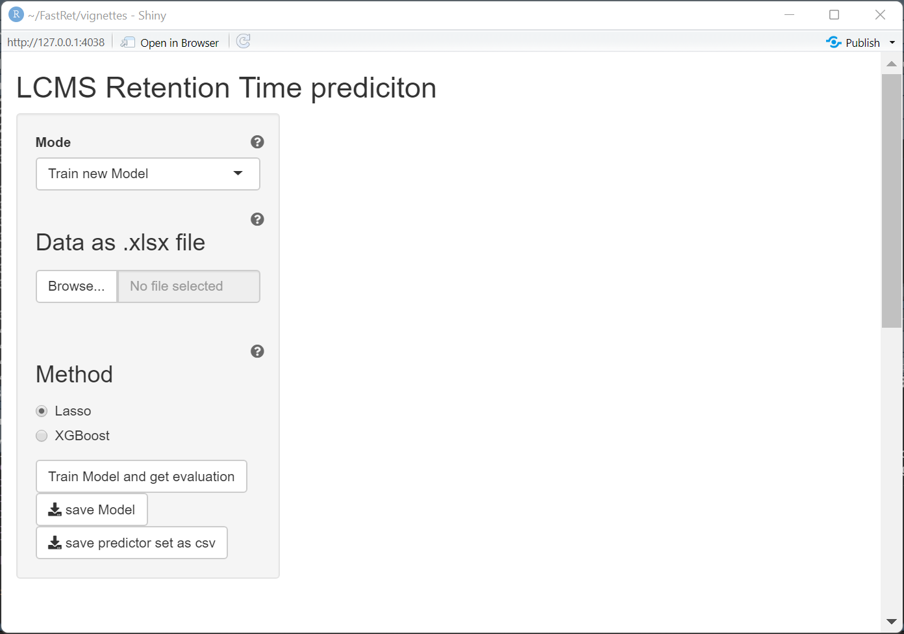
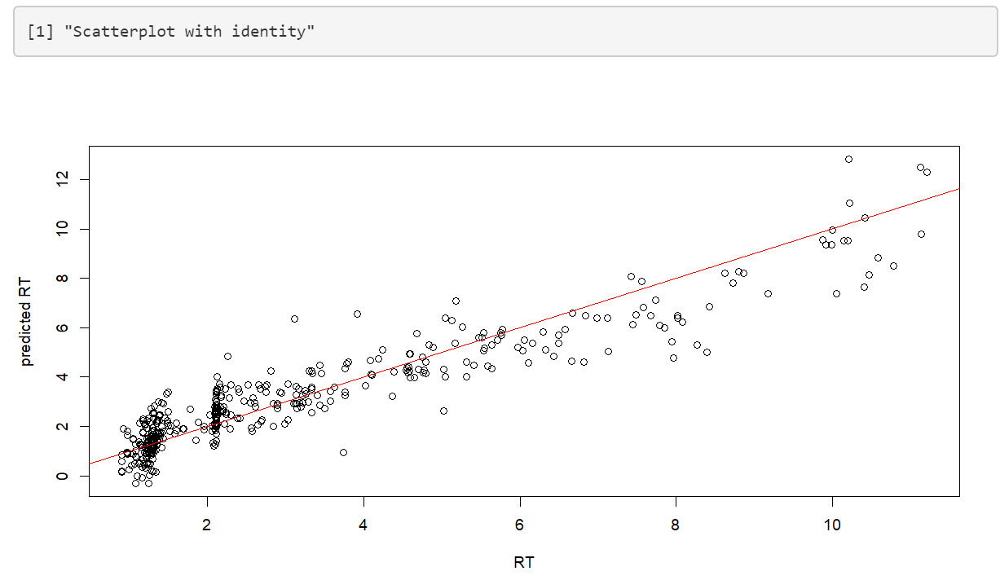
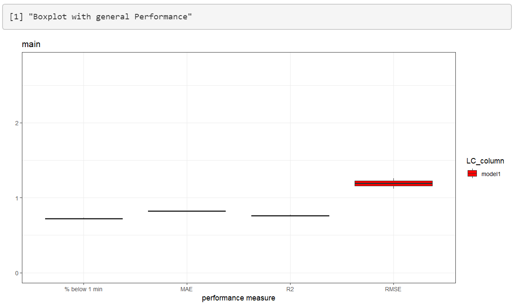
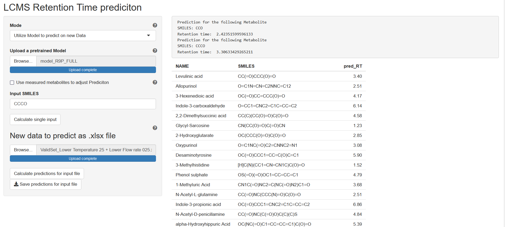
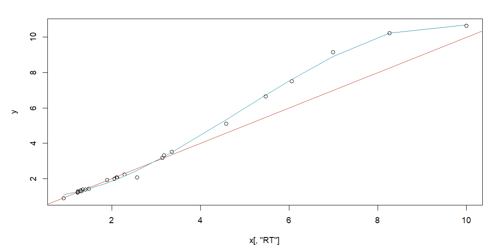

```{r, include = FALSE}
knitr::opts_chunk$set(
  collapse = TRUE,
  comment = "#>"
)
```

Welcome to this introduction vignette for FastRet. THis tutorial will show you how to use FastRet and what to pay attention to when using it. 


```{r setup}
library(FastRet)

```

Before starting our analysis lets save some data just as you might have it laying around. The resulting excel file does need to have three columns, RT, SMILES and NAME. 

```{r data}
data(RP)
xlsx::write.xlsx(RP,file= "~/RP_data.xlsx",row.names = FALSE)
``` 
Starting the interface is done with one line of code. From now on there is no need to use R anymore.
```{r gui,eval = FALSE}

FastRet()

```

All objects are additionally explained in more detail if you click on the question mark. 
{width=70%}

## Train new Model
Staying in the mode "Train new Model" we can upload our previously saved excel file and start training the regression model. This might take some time depending on the size of the training set. This is due to the process of calculating chemical descriptors with rcdk. On the top right you can see a loading symbol if the process is still running. 

Once the training is complete, a boxplot with performance measures as well as a scatterplot of predicted~actual retention time is shown. This can be used to get a first impression of the performance that can be expected.

{width=41%} {width=41%}


If you want to utilize the trained model on new data, you have to first save the model and then reload it again in the "Utilize Model" category. The model you download is trained on the whole data set without a validation set. All performance measures of the boxplot are evaluated using cross validation.


## Utilize Model to predict on new data 
In this mode your previously saved model can be used to predict on new data. This data can be either provided with the input of a single SMILES or a whole .xlsx file which. 

{width=80%}


### Adjusting measurements using a linear model 
If you have measured some metabolites on your new experiment setup that were also measured on the original setup, you can use this method to adjust the models prediction with a linear model. Simply check "Use measured metabolites to adjust Prediction" and upload an exel file with the corresponding SMILES/retention time data. After you click on "Analyze Linear Model" a scatter plot will be shown, displaying the old vs the new retention times of your measured metabolites. This plot helps you decide which components of the linear model to select. 

{width=49%}


## Selective Measuring 
This mode calculates, for a given data set, the best k molecules to be measured for a retention time prediction on a new experiment setup. It uses a combination of Ridge Regression and k-means to determine the best representatives of your dataset. Representatives as well as their corresponding clusters can be downloaded afterwards as an excel file. This step should be used once you have a predictive model and/or data set and want to use it for new column/gradient/temperature... combination.

By providing an excel file with SMILES, NAME and RT and a custom k you can simply start the process and export another excel file which will show your clusters as well as your metabolites.

